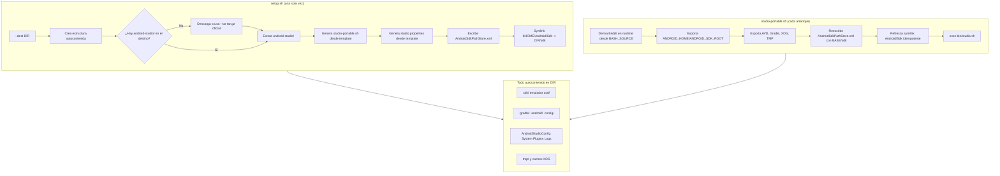

# android-studio-portable

Android Studio **autocontenido en un solo directorio**: el IDE, el SDK de Android, los emuladores (AVDs), Gradle, las cachés, la configuración de JetBrains y los temporales viven **dentro de una única carpeta**. Podés mover esa carpeta, copiarla a otra máquina o borrarla entera sin dejar rastros.

> TL;DR: `./setup.sh --dest $HOME/AndroidStudio-Portable` descarga el tar.gz oficial de Google, instala todo en esa carpeta y te deja un lanzador `studio-portable.sh`. Nada se escribe fuera del directorio salvo un symlink (`$HOME/Android/Sdk`) que el IDE necesita y que se puede desactivar.

---

## ¿Para quién es?

| Perfil | Qué te aporta |
|---|---|
| **Usuarios no técnicos** | Android Studio "en una carpeta": instalás, usás, y si querés sacártelo de encima, borrás la carpeta. Sin instaladores del sistema, sin permisos de administrador. |
| **Desarrolladores** | Entorno reproducible y desplegable por scripts: control total de variables (`ANDROID_HOME`, `GRADLE_USER_HOME`, rutas XDG/temporales), sin binarios en el repo, con suite de pruebas. |
| **Estudiantes / laboratorios** | Misma versión exacta en varias máquinas: clonás el repo, corrés `setup.sh`, y todos quedan iguales. |

---

## ¿Qué requisitos necesito?

- Linux (validado en Fedora/KDE) con **bash 5.x**
- `tar` y `curl` o `wget`
- Si querés usar el emulador de Android: **KVM activado**

No necesitás `sudo`, ni Java/Gradle instalados por separado (el IDE trae su propio runtime `jbr/`).

---

## ¿Cómo instalo?

```bash
# 1. Cloná el repo
git clone https://github.com/EchoBit3/android-studio-portable.git
cd android-studio-portable

# 2. Opcional pero recomendado: corré las pruebas
bash tests/run-tests.sh            # 102 aserciones de caja negra y blanca

# 3. Instalá (descarga ~1.5 GB del tar.gz oficial de Google)
./setup.sh --dest "$HOME/AndroidStudio-Portable"

# 4. Otro ejemplo: usá un tar.gz que ya tenés descargado (sin red en el setup)
./setup.sh --dest "$HOME/AndroidStudio-Portable" --tar ~/Descargas/android-studio-*-linux.tar.gz

# 5. Lanzá
"$HOME/AndroidStudio-Portable/studio-portable.sh"
```

Ver todas las opciones: `./setup.sh --help`, `./uninstall.sh --help`.

---

## ¿Cómo actualizo y mantengo la instalación al día?

Hay **dos niveles** de actualización y conviene diferenciarlos:

| Qué se actualiza | Cómo | Automático |
|---|---|---|
| **El IDE** (Android Studio + SDK) | El lanzador `studio-portable.sh` revisa contra Google la última versión estable (caché 24 h) y, si hay una nueva, descarga, verifica sha256 y hace el swap atómico dejando un `.prev` de respaldo | Sí, al arrancar |
| **Los scripts del proyecto** (`setup.sh`, lanzador, `lib-portable.sh`, `studio.properties`) | Re-corrés `setup.sh --dest ...` (idempotente) o re-clonás el repo | No — manual |

### Actualizar los scripts del repo (sync manual)

Si cambiás este repo (o lo actualizás con `git pull`) y querés que tu instalación portable use los scripts nuevos, basta re-correr el instalador. Es **idempotente**: si `android-studio/` ya existe no vuelve a descargar ni toca el IDE; solo regenera el lanzador, la librería y la configuración desde el repo:

```bash
# 1. Si cambiaste algo o querés la última versión del repo
git pull            # dentro del clon del repo

# 2. Re-sincronizá la instalación (no re-descarga el IDE)
./setup.sh --dest "$HOME/AndroidStudio-Portable"
```

> **TL;DR**: el IDE se actualiza solo; los scripts se sincronizan con un re-setup manual. No hay un "auto-sync de scripts" a propósito: el lanzador no se regenera desde el repo en cada arranque porque eso haría la instalación dependiente del clon y lenta. Si querés forzar el sync además con el lanzador en uso, corré el re-setup y después abrí `studio-portable.sh`.

---

## ¿Cómo funciona?

### En una frase (para todos)

El lanzador `studio-portable.sh` abre Android Studio diciéndole: *"guardá **todo** —proyectos aparte, configuración, SDK, emuladores, cachés, temporales— dentro de la carpeta donde yo estoy parado"*. Eso se logra exportando variables de entorno que el IDE y las herramientas de Android ya respetan.

### Diagrama de flujo



> La fuente del diagrama es `docs/assets/portable-flujo.md` (Mermaid renderizado por GitHub). El archivo se mantiene ahí para que se visualice correctamente en el repo.

### Detalle técnico (para desarrolladores)

El lanzador (`src/studio-portable.sh.in`) hace cinco cosas en cada arranque:

1. **Deriva su base en runtime** desde `BASH_SOURCE`, así la carpeta se puede mover o renombrar sin reconfigurar nada.
2. **Exporta variables de entorno** apuntando a subcarpetas del directorio:

   | Variable | Subcarpeta | Qué contiene |
   |---|---|---|
   | `ANDROID_HOME` / `ANDROID_SDK_ROOT` | `sdk/` | SDK de Android, plataformas, build-tools |
   | `ANDROID_AVD_HOME` | `avd/` | Emuladores (AVDs) |
   | `ANDROID_USER_HOME` | `.android/` | Estado SDK/AVD de Google |
   | `GRADLE_USER_HOME` | `.gradle/` | Caché y wrapper de Gradle |
   | `XDG_CONFIG_HOME`, `XDG_CACHE_HOME`, `XDG_DATA_HOME` | `.config/`, `.cache/`, `.local/share/` | Config/caché/datos de escritorio |
   | `TMPDIR`, `TEMP`, `TMP` | `tmp/` | Temporales |
   | `STUDIO_PROPERTIES` | `studio.properties` | Opciones JetBrains extendidas |
3. **Reescribe la ruta del SDK que el asistente hardcodea** (`AndroidStudioConfig/options/AndroidSdkPathStore.xml`). Android Studio persiste ahí la ruta absoluta del SDK la primera vez; este proyecto la sobreescribe con `$BASE/sdk` real en cada arranque.
4. **Refresca el symlink idempotente** `$HOME/Android/Sdk -> $BASE/sdk`: algunos componentes de Google solo saben buscar el SDK en `~/Android/Sdk`. Se crea con `ln -sfn` (no falla si ya existe) y `uninstall.sh` solo lo borra si apunta a este destino.
5. **Delega en el IDE**: `exec bin/studio.sh`.

### ¿Por qué el symlink y el XML? (la decisión incómoda)

Android Studio tiene **dos caminos** para saber dónde está el SDK, y ninguno respeta el 100% de las variables:

- El asistente de configuración y varios componentes **persisten** la ruta en `AndroidSdkPathStore.xml` (no la derivan de `ANDROID_HOME`).
- Otras herramientas buscan **directamente** en `~/Android/Sdk`.

Por eso el lanzador ataca los dos frentes: reescribe el XML **y** crea el symlink. Es la única forma probada de que la instalación siga siendo realmente portable — documentado con su fallo original en `docs/04-fallos.md` (F1).

---

## ¿Qué hace cada archivo?

| Archivo | Rol |
|---|---|
| `setup.sh` | Instalador: crea la estructura, extrae el IDE (descarga la última estable o usa `--tar`), genera lanzador + config, symlink. Flags: `--dest`, `--tar`, `--home`, `--no-symlink`, `--help`. |
| `uninstall.sh` | Revierte el setup. Flags: `--dest`, `--home`, `--keep-binaries`. |
| `src/studio-portable.sh.in` | Template del lanzador (sin rutas del operador; deriva todo en runtime). |
| `src/studio.properties.in` | Template de configuración JetBrains con rutas relativas. |
| `src/lib-portable.sh` | Librería reutilizable (resolución de versión estable, actualización del IDE). |
| `tests/` | 6 suites de caja negra y blanca (102 aserciones). |
| `.github/` | CI, code scanning (ShellCheck) y Dependabot. |
| `docs/` | Cómo funciona, por qué se decidió así, pruebas, QA, privacidad, leyes/ISO. |
| `VERSION` | Versión SemVer del repo (ver `CHANGELOG.md`). |

---

## ¿Cómo verifico la calidad?

```bash
bash tests/run-tests.sh
```

- **102 aserciones verde** en 6 suites (setup, lanzador, uninstall, update, whitebox contenido, whitebox seguridad).
- **CI en GitHub Actions** corre la misma batería en cada push/PR a `main` y `dev`.
- **Code scanning (ShellCheck)** sube hallazgos al tab de Seguridad del repo.
- **Dependabot** mantiene seguras las acciones de los workflows.
- **Secret scanning** activo: GitHub detecta tokens/claves filtrados antes de que se propaguen.

Estrategia de pruebas en `docs/02-pruebas.md`; registro de fallos y su solución en `docs/04-fallos.md`; checklist QA completo en `docs/05-qa.md`.

## ¿Qué sabe de vos el proyecto? (privacidad)

Este proyecto **no recopila datos**: no pide correo, no tiene telemetría, no guarda estadísticas. Todo lo que genera Android Studio queda en tu carpeta portable. Lo único que se escribe fuera es el symlink `$HOME/Android/Sdk` (removible con `uninstall.sh`). Detalle completo en `docs/06-privacidad.md`.

## ¿Contra qué estándares se mide?

El proyecto se documenta contra estándares internacionales (ISO/IEC 25010 calidad, ISO/IEC 27001/27002 seguridad, ISO/IEC 12207 ciclo de vida) y la normativa chilena de datos y ciberseguridad vigente. Ver `docs/07-estandares.md`.

## ¿Cómo se versiona?

El repo usa versionado semántico: la versión actual vive en `VERSION` (SemVer `MAJOR.MINOR.PATCH`) y los cambios por hito en `CHANGELOG.md`. Los commits siguen Conventional Commits (prefijos `feat|fix|docs|test|ci|chore`) y los PRs van `feat/*` → `dev` → `main`.

## Reproducibilidad

`git clone` + `./setup.sh --dest ...` sin flags extra: el setup deriva en runtime la ubicación del tar (resolviendo la URL estable oficial), todas las rutas de usuario (`[BASH_SOURCE]`, `$HOME`, `%h`) y no contiene nombres ni rutas de su autor. En `docs/03-entorno.md` está el entorno donde fue validado.

## Licencia

MIT — Port en `LICENSE`.

---

> ¿Sirve para tu caso? Cloná el repo, corré `bash tests/run-tests.sh` y probá `./setup.sh --dest ...`. ¿Encontraste un entorno donde no anda o una mejora? Abrí un issue o aportá la prueba: la base está en `docs/05-qa.md` y el cómo en `docs/04-fallos.md`.