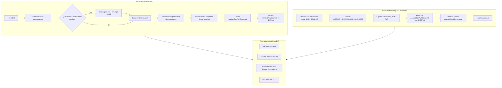

# ¿Cómo convive todo dentro de una sola carpeta?

> GitHub renderiza Mermaid solo dentro de bloques de código en Markdown (no en `.mmd`).
> Este archivo es la fuente canónica que sí se visualiza en el repo.

TL;DR: existen **dos momentos** — el setup (una vez) y cada arranque — y en ambos la clave es **decirle al IDE y a las herramientas de Android dónde está la base** con variables de entorno y un store XML, en vez de permitir que usen rutas de sistema.

## Decisiones técnicas por fase

| Fase | Por qué así |
|---|---|
| `C` → reutiliza `android-studio/` si ya existe | **Idempotencia**: repetir `setup.sh` no re-descarga; los hashes se comparan contra una instalación real (test whitebox). |
| `H`/`M` → reescribe `AndroidSdkPathStore.xml` | El asistente de Google **ignora `ANDROID_HOME`**: hardcodea la ruta del SDK contra `$HOME`. Reescribir el store es la única forma de que apunte a `DIR/sdk` (ver `04-fallos.md` F1). |
| `I`/`N` → symlink `$HOME/Android/Sdk` | Algunos componentes de Android **solo** leen el SDK desde ahí; un symlink de 0 bytes cubre eso sin copiar nada. Es el único archivo fuera de `DIR` (trade-off documentado en `01-diseno.md`). |
| `J` → `BASE` derivado de `BASH_SOURCE` | Portabilidad real: movés la carpeta y el lanzador sigue encontrando la base sin configuración ni rutas fijas. |
| `N` → symlink idempotente (`ln -sfn`) | Cada arranque refresca el enlace sin error si ya existe. |

> Over to you: ¿cambiarías alguna de estas decisiones o agregarías una fase? Dejalo anotado y cerralo con su test en `docs/04-fallos.md`.